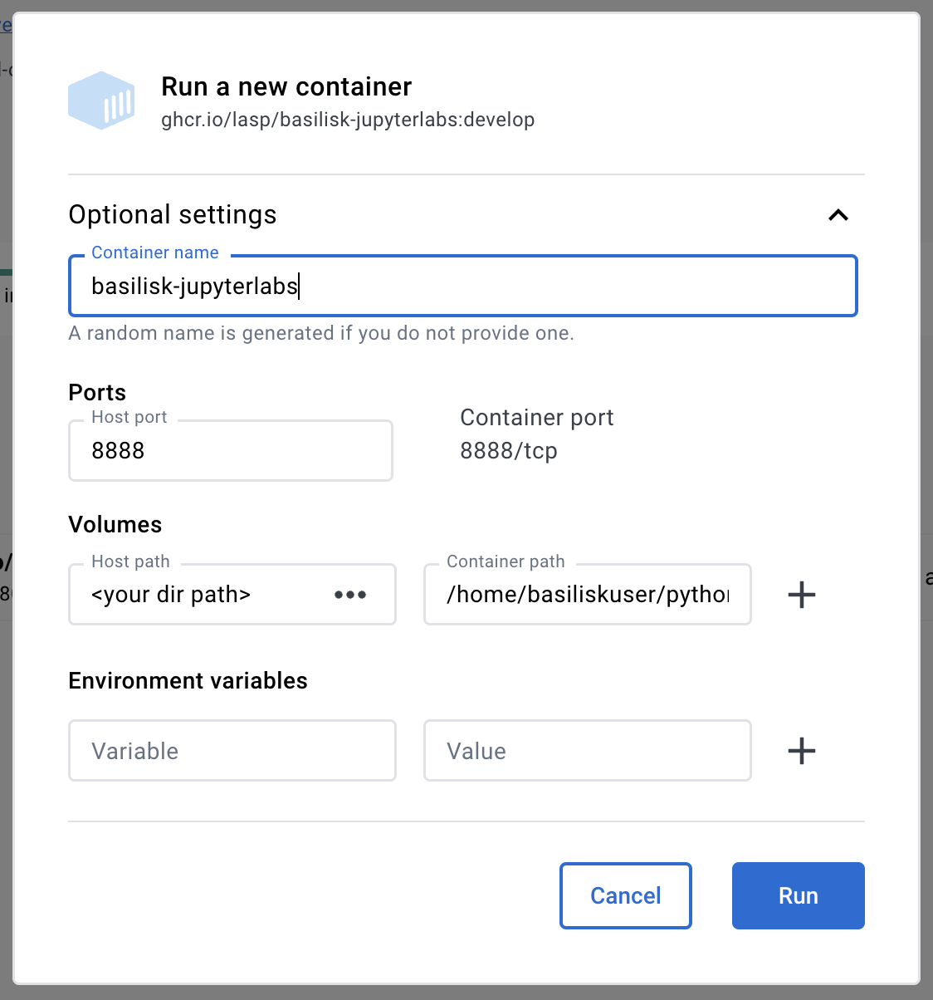

# basilisk-jupyterlabs
A jupyter labs Basilisk simulation development environment 

# Using the container image
## 1. Install Docker Desktop or Podman Desktop

Docker: 
- Mac: just download and install
- Linux: install from your package manager
- Windows: https://docs.docker.com/desktop/install/windows-install/

Podman: https://podman-desktop.io/

## 2. Launch Docker Desktop or Podman Desktop

## 3. Pull the container image

Open terminal and run docker/podman pull. Run the following command. This command can also be copy and pasted 
from https://github.com/lasp/basilisk-dev-environment/pkgs/container/basilisk-dev-environment

`docker pull ghcr.io/lasp/basilisk-jupyterlabs:develop`

## 4. Run in Docker Desktop or Podman Desktop

Launch a container using the image with the following command

`docker run -it -p 8888:8888 -v /<path-to-your-local-host-directory>:/home/basiliskuser/python-workspace/my-files \
--name basilisk-workspace ghcr.io/lasp/basilisk-jupyterlabs:develop bash`

One can also launch a container from the image using the Docker Desktop UI. Clicking the play button on the 
basilisk-jupyterlabs image in the Images list. Set the following parameters as shown in the below launch 
parameters dialogue.

- name: 
  - whatever you like
- port: 
  - 8888
- Volumes: 
  - <path to your choice of a local host directory with your python/ipynb files>
  - Container path: /home/basiliskuser/python-workspace/my_files

## 5. Launch Jupyterlabs in browser

Once launched in the console output, click/copy-and-paste the output link to a browser to launch JupyterLabs
